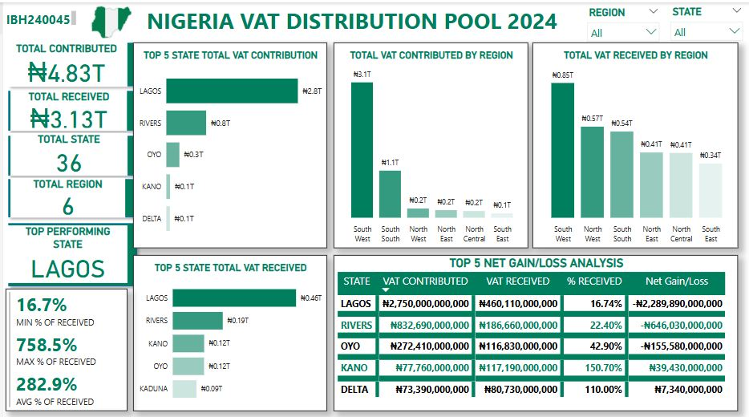

# Nigeria-VAT-Pool-2024
Data Analysis on VAT pool in Nigeria 2024 using Excel and Power BI

## Description

This project presents an analysis of the Value Added Tax (VAT) Pool in Nigeria 2024 using  **Excel** and **Power BI**. It is organized to demonstrate skills in data cleaning, transformation, and visualization.

---

## 🧹 Data Cleaning Process

The following steps were taken to clean and prepare the VAT dataset for analysis:

- ✅ **Removed duplicates:** Ensured there were no repeated records for states or VAT entries.
- ✅ **Standardized state names:** Corrected any spelling inconsistencies or formatting errors in state name.
- ✅ **Handled missing values:** Checked for and filled any missing values however there was none.
- ✅ **Converted data types:** Changed VAT amount fields to numeric format for accurate calculations and sorting.
- ✅ **Created new columns:** Added computed fields such as `Net gain/loss` (Received - Contributed).

This process ensured a clean, consistent, and analysis-ready dataset.

## 🎯 Analysis Objectives

- Identify which states contribute more to the VAT pool than they receive, and which states receive more than they contribute.
- Calculate the net difference for each state (Amount Received - Amount Contributed) to highlight net contributors and beneficiaries.
- Rank all states based on VAT contributed, VAT received, and the percentage received relative to contribution.
- Evaluate whether VAT revenue is shared fairly among states, considering their economic input and returns.
- Identify states with unusually high or low percentage receipts to flag potential imbalances or anomalies in distribution.

---

## 🧪 Tools Used

- **Excel**: Data review and pivots
- **Power BI**: Interactive dashboards

---

## 📊 Sample Dashboard

---

## 📊 Key Insights from VAT Pool Analysis

1. **Regional VAT Distribution**  
   - South-West contributes the most (₦3.1T), largely driven by Lagos.  
   - North-West receives the highest allocation (₦0.85T), despite contributing far less.

2. **Net Gain/Loss Analysis**  
   - Lagos and Rivers are the biggest net losers, contributing far more than they receive.  
   - Kano and Delta benefit from VAT redistribution, receiving more than they contributed.  
   - Kaduna also receives significantly more than it contributes.

3. **Total VAT Contributed vs. Received** 

   - **Total VAT Contributed:** ₦4.83 Trillion  
   - **Total VAT Received:** ₦3.13 Trillion  
   - *Note:* The discrepancies may result from the sharing formula involving Federal and Local Governments.

4. **Lagos as the Biggest Contributor**  
   - Lagos alone contributes approximately 58% of the total VAT pool, followed by Rivers.  
   - However, their received VAT is disproportionately lower compared to their contribution.

---

## 📢 Conclusion & Recommendations

- 🔹 The current VAT redistribution model heavily favors less economically active states, which raises fairness concerns.  
- 🔹 High-contributing states like Lagos and Rivers may need a higher share of their VAT revenue to sustain infrastructure and business growth.  
- 🔹 States that rely on VAT allocations should focus on boosting economic activities to increase their self-sufficiency.  
- 🔹 A possible review of the VAT sharing formula could ensure a more balanced system that encourages productivity while maintaining national economic stability.

